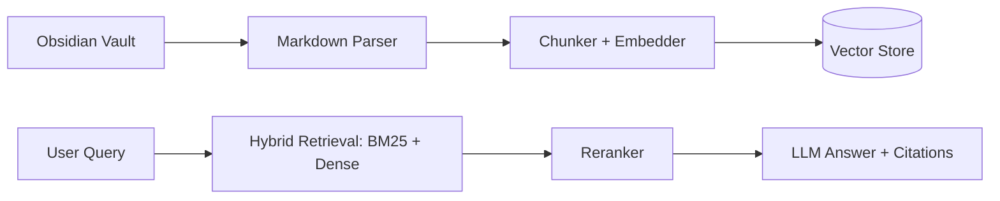

# OBS-RAG — Obsidian Second-Brain RAG Pipeline

> **Ask your notes anything.** RAG pipeline over Obsidian vaults — hybrid retrieval (BM25 + dense + reranking) for personal knowledge.

### Demo

> 🎬 **Demo coming soon** — screen capture will be added at `docs/demo.gif`

### Architecture

### Results

| Metric | Value |
|---|---|
| **Retrieval** | Hybrid BM25 + dense + rerank |
| **Source** | Obsidian markdown vaults |

---

**Phirawit Jitnarong — Strategic Full-Stack & AI Engineer**

xme176@gmail.com · 092-551-0427 · [LinkedIn](https://www.linkedin.com/in/%E0%B8%9E%E0%B8%B5%E0%B8%A3%E0%B8%A7%E0%B8%B4%E0%B8%8A%E0%B8%8D%E0%B9%8C-%E0%B8%88%E0%B8%B4%E0%B8%95%E0%B8%93%E0%B8%A3%E0%B8%87%E0%B8%84%E0%B9%8C-0000393a4) · [Fastwork](https://fastwork.co/user/bravforcode?source=search)

> Hiring for this stack? Let's talk — production hardened, 300k+ users shipped.