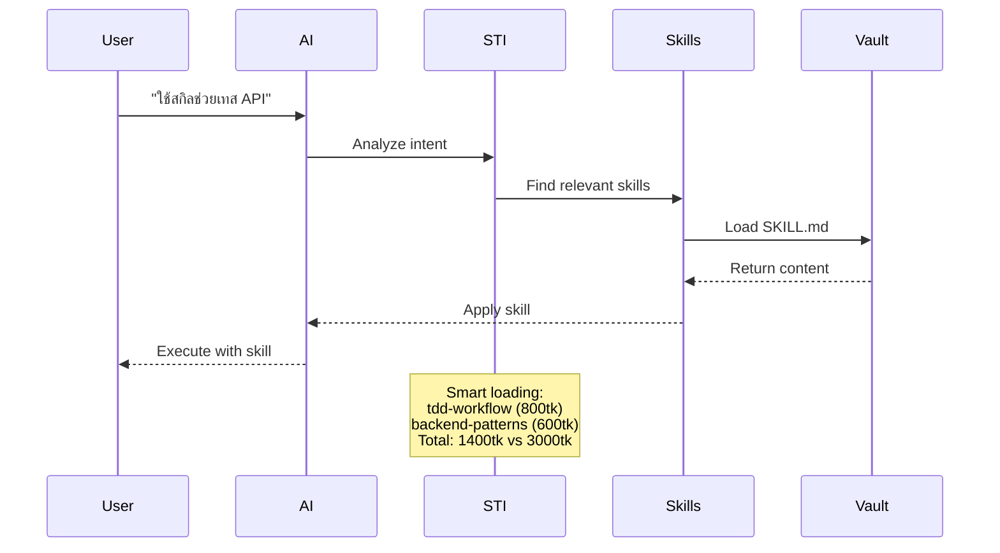

# 🔗 Connection Map - Complete Vault Network

**เวอร์ชัน:** 3.0 Complete
**วันที่:** 2026-04-28
**ไฟล์ทั้งหมด:** 50+ connected nodes

---

## 🗺️ Master Connection Graph

```mermaid
graph TB
    subgraph "🎯 Entry Points"
        START["🧭 START-HERE.md"]
        STATUS["📊 SYSTEM-STATUS.md"]
        ATLAS["🗺️ Atlas"]
        DASH["Dashboard"]
    end

    subgraph "🧠 AI Systems Core"
        SKILLS["⚡ Skills Hub<br/>1,390 skills"]
        RAG["🧠 RAG System"]
        STI["🎯 STI Engine"]
        ROUTER["skills-router.md"]
        REGISTRY["skills-registry-compact.json"]
        SMART_LOADER["_smart-skill-loader"]
    end

    subgraph "🤖 AI Tools Integration"
        CLAUDE["Claude Code"]
        CURSOR["Cursor"]
        WINDSURF["Windsurf"]
        GEMINI["Gemini"]
        COPILOT["GitHub Copilot"]
        ANTIGRAVITY["Antigravity"]
    end

    subgraph "📁 Vault Structure"
        INBOX["📥 00-Inbox"]
        PROJECTS["📁 01-Projects"]
        AREAS["🎯 02-Areas"]
        RESOURCES["📚 03-Resources"]
        ARCHIVE["📦 04-Archive"]
        PEOPLE["👥 05-People"]
        MEETINGS["🤝 06-Meetings"]
        DAILY["📅 07-Daily"]
    end

    subgraph "🗂️ Index Systems"
        MOC["🗺️ MOCs"]
        MOC_WORK["MOC/Work"]
        MOC_PERSONAL["MOC/Personal"]
        MOC_LEARNING["MOC/Learning"]
        MOC_FINANCE["MOC/Finance"]
        MOC_RESEARCH["MOC/Research"]
    end

    subgraph "⚙️ Meta & Config"
        META["🤖 Meta/"]
        META_AI["Meta/AI/"]
        SMART_SYS["Smart-Skill-System"]
        AGENT_ADAPTERS["Agent-Adapters"]
        PROJECT_MAP["Project-Autoload-Map"]
        TOKEN_TRACKER["Token-Budget-Tracker"]
    end

    subgraph "🛠️ Tools & Templates"
        TEMPLATES["📝 Templates"]
        EXCALIDRAW["✏️ Excalidraw"]
        SYSTEM["⚙️ System"]
    end

    subgraph "📚 Knowledge Base"
        KNOWLEDGE["📖 Knowledge/"]
        WIKI["🌐 wiki/"]
        BRAIN["🧠 brain/"]
    end

    subgraph "🔗 Management Systems"
        ULTRA_REVIEW["🔍 ULTRA-REVIEW"]
        AUTO_MAINTENANCE["🤖 Auto-Maintenance"]
        ANALYTICS["📊 Analytics"]
        SMART_SEARCH["🔎 Smart Search"]
    end

    subgraph "🤖 Auto Systems Suite"
        AUTO_LINKER["🔗 Auto Linker"]
        AUTO_CLASSIFIER["🗂️ Auto Classifier"]
        AUTO_TAGGER["🏷️ Auto Tagger"]
        GITHUB_SYNC["🔄 GitHub Sync"]
        VAULT_OPT["🚀 Vault Optimizer"]
    end

    subgraph "🛠️ CLI & Automation"
        CLI["brain/cli/"]
        VAULT_CMD["vault-cli.py"]
        GIT_HOOKS["brain/git-hooks/"]
        WORKFLOWS[".windsurf/workflows/"]
    end

    subgraph "📦 Project Templates"
        TPL_FASTAPI["FastAPI Template"]
        TPL_REACT["React Template"]
        TPL_ML["ML Template"]
    end

    subgraph "🧠 Advanced Systems"
        MEMORY["AI Memory"]
        LEARNING["Learning Paths"]
        KNOWLEDGE_GRAPH["Knowledge Graph v2"]
        ADV_ANALYTICS["Advanced Analytics"]
    end

    %% Entry Point Connections
    START --> STATUS
    START --> SKILLS
    START --> RAG
    START --> ATLAS
    START --> MOC
    START --> INBOX
    STATUS --> META
    STATUS --> ULTRA_REVIEW

    %% Skills System
    SKILLS --> ROUTER
    SKILLS --> REGISTRY
    SKILLS --> SMART_LOADER
    SKILLS --> STI
    STI --> RAG
    ROUTER --> CLAUDE
    ROUTER --> CURSOR
    ROUTER --> WINDSURF
    ROUTER --> GEMINI
    ROUTER --> COPILOT
    ROUTER --> ANTIGRAVITY

    %% AI Tools to Global Configs
    CLAUDE --> CLAUDE_CFG["~/.claude/CLAUDE.md"]
    CURSOR --> CURSOR_CFG["~/.cursor/cursor.rules"]
    WINDSURF --> WINDSURF_CFG["~/.windsurf/windsurf.rules"]
    GEMINI --> GEMINI_CFG["~/.gemini/config.yaml"]
    COPILOT --> COPILOT_CFG["~/.codex/config.yaml"]
    ANTIGRAVITY --> ANTIGRAVITY_CFG["~/.antigravity/config.yaml"]

    %% Vault Structure to MOCs
    INBOX --> MOC
    PROJECTS --> MOC_WORK
    AREAS --> MOC_PERSONAL
    RESOURCES --> MOC_LEARNING
    RESOURCES --> KNOWLEDGE
    KNOWLEDGE --> WIKI
    KNOWLEDGE --> BRAIN

    %% MOC Hierarchy
    MOC --> MOC_WORK
    MOC --> MOC_PERSONAL
    MOC --> MOC_LEARNING
    MOC --> MOC_FINANCE
    MOC --> MOC_RESEARCH

    %% Meta Connections
    META --> META_AI
    META_AI --> SMART_SYS
    META_AI --> AGENT_ADAPTERS
    META_AI --> PROJECT_MAP
    META_AI --> TOKEN_TRACKER
    SMART_SYS --> SKILLS
    AGENT_ADAPTERS --> CLAUDE
    AGENT_ADAPTERS --> CURSOR
    AGENT_ADAPTERS --> WINDSURF

    %% Management Systems
    ULTRA_REVIEW --> START
    ULTRA_REVIEW --> STATUS
    ULTRA_REVIEW --> SKILLS
    AUTO_MAINTENANCE --> INBOX
    AUTO_MAINTENANCE --> SYSTEM
    AUTO_MAINTENANCE --> KNOWLEDGE_GRAPH
    ANALYTICS --> STATUS
    ANALYTICS --> ADV_ANALYTICS
    SMART_SEARCH --> KNOWLEDGE
    SMART_SEARCH --> SKILLS

    %% Auto Systems
    VAULT_OPT --> AUTO_LINKER
    VAULT_OPT --> AUTO_CLASSIFIER
    VAULT_OPT --> AUTO_TAGGER
    VAULT_OPT --> GITHUB_SYNC
    AUTO_LINKER --> INBOX
    AUTO_LINKER --> KNOWLEDGE_GRAPH
    AUTO_CLASSIFIER --> INBOX
    AUTO_CLASSIFIER --> PROJECTS
    AUTO_CLASSIFIER --> AREAS
    AUTO_CLASSIFIER --> RESOURCES
    AUTO_TAGGER --> SKILLS
    AUTO_TAGGER --> KNOWLEDGE
    AUTO_TAGGER --> INBOX
    GITHUB_SYNC --> SKILLS
    GITHUB_SYNC --> REGISTRY

    %% CLI & Automation
    CLI --> VAULT_CMD
    VAULT_CMD --> STATUS
    VAULT_CMD --> ANALYTICS
    VAULT_CMD --> KNOWLEDGE_GRAPH
    VAULT_CMD --> SMART_SEARCH
    GIT_HOOKS --> AUTO_MAINTENANCE
    WORKFLOWS --> SKILLS

    %% Templates
    TPL_FASTAPI --> CLI
    TPL_REACT --> CLI
    TPL_ML --> CLI
    TPL_FASTAPI --> SKILLS
    TPL_REACT --> SKILLS
    TPL_ML --> SKILLS

    %% Advanced Systems
    MEMORY --> SKILLS
    MEMORY --> KNOWLEDGE
    LEARNING --> KNOWLEDGE
    LEARNING --> SKILLS
    KNOWLEDGE_GRAPH --> START
    KNOWLEDGE_GRAPH --> BRAIN
    KNOWLEDGE_GRAPH --> STATUS
    ADV_ANALYTICS --> ANALYTICS
    ADV_ANALYTICS --> STATUS

    %% Templates & Tools
    TEMPLATES --> SYSTEM
    SYSTEM --> META
    EXCALIDRAW --> KNOWLEDGE

    %% Cross-connections
    BRAIN --> SKILLS
    BRAIN --> RAG
    BRAIN --> STI
    WIKI --> RESOURCES
    DAILY --> MOC_PERSONAL
    MEETINGS --> MOC_WORK
    PEOPLE --> MOC_PERSONAL
    ARCHIVE --> MOC

    %% Inbox Processing
    INBOX --> ZERO_SETUP["ZERO-SETUP-SKILL-LOADER"]
    INBOX --> AI_MODELS["AI-MODELS-SETUP-GUIDE"]
    INBOX --> ULTRA_REVIEW

    %% Styling
    style START fill:#4CAF50,stroke:#2E7D32,stroke-width:4px,color:#fff
    style SKILLS fill:#2196F3,stroke:#1565C0,stroke-width:3px,color:#fff
    style RAG fill:#FF9800,stroke:#E65100,stroke-width:3px,color:#fff
    style STI fill:#E91E63,stroke:#C2185B,stroke-width:3px,color:#fff
    style META fill:#9C27B0,stroke:#6A1B9A,stroke-width:3px,color:#fff
    style ULTRA_REVIEW fill:#F44336,stroke:#B71C1C,stroke-width:3px,color:#fff
    style CLAUDE fill:#00BCD4,stroke:#00838F,stroke-width:2px,color:#fff
    style CURSOR fill:#00BCD4,stroke:#00838F,stroke-width:2px,color:#fff
    style WINDSURF fill:#00BCD4,stroke:#00838F,stroke-width:2px,color:#fff
```



---

## 📍 Node Details

### 🎯 Entry Points (เริ่มต้นที่นี่)

| Node             | File               | เชื่อมกับ       | Purpose     |
| ---------------- | ------------------ | --------------- | ----------- |
| 🧭 START-HERE    | `START-HERE.md`    | ทุกระบบหลัก     | จุดเริ่มต้น |
| 📊 SYSTEM-STATUS | `SYSTEM-STATUS.md` | Health, Metrics | ดูสถานะ     |
| 🗺️ Atlas         | `Atlas.md`         | Navigation      | แผนที่      |
| Dashboard        | `Dashboard.md`     | Overview        | ภาพรวม      |

### 🧠 AI Systems Core

| Node          | File                           | เชื่อมกับ   | Purpose               |
| ------------- | ------------------------------ | ----------- | --------------------- |
| ⚡ Skills Hub | `brain/skills-universal/`      | ทุก AI tool | 1,390 สกิล            |
| 🧠 RAG System | `brain/rag-system/`            | Skills, STI | Token intelligence    |
| 🎯 STI Engine | `SMART-TOKEN-INTELLIGENCE.md`  | RAG         | Quality-first loading |
| Router        | `skills-router.md`             | Registry    | เลือกสกิล             |
| Registry      | `skills-registry-compact.json` | All skills  | Index                 |
| Smart Loader  | `_smart-skill-loader/`         | AI tools    | Auto-loading          |

### 🤖 AI Tools (6 tools)

| Tool           | Config File                  | เชื่อมกับ       | Status        |
| -------------- | ---------------------------- | --------------- | ------------- |
| Claude Code    | `~/.claude/CLAUDE.md`        | Skills, Meta/AI | 🟢 Ready      |
| Cursor         | `~/.cursor/cursor.rules`     | Skills, Meta/AI | 🟢 Ready      |
| Windsurf       | `~/.windsurf/windsurf.rules` | Skills, Meta/AI | 🟢 Ready      |
| Gemini         | `~/.gemini/config.yaml`      | Skills          | 🟡 Setup once |
| GitHub Copilot | `~/.codex/config.yaml`       | Skills          | 🟡 Setup once |
| Antigravity    | `~/.antigravity/config.yaml` | Skills          | 🟡 Setup once |

### 📁 Vault Structure (PARA)

| Folder          | เชื่อมกับ               | Content        |
| --------------- | ----------------------- | -------------- |
| 📥 00-Inbox     | MOC, Auto-Maintenance   | ไฟล์รอประมวลผล |
| 📁 01-Projects  | MOC/Work                | โปรเจกต์       |
| 🎯 02-Areas     | MOC/Personal            | พื้นที่        |
| 📚 03-Resources | MOC/Learning, Knowledge | ทรัพยากร       |
| 📦 04-Archive   | MOC                     | ที่เก็บ        |
| 👥 05-People    | MOC/Personal            | บุคคล          |
| 🤝 06-Meetings  | MOC/Work                | ประชุม         |
| 📅 07-Daily     | MOC/Personal            | บันทึก         |

### 🗂️ Index Systems

| MOC          | เชื่อมกับ            | Content     |
| ------------ | -------------------- | ----------- |
| MOC/Work     | Projects, Meetings   | งาน         |
| MOC/Personal | Areas, People, Daily | ส่วนตัว     |
| MOC/Learning | Resources, Knowledge | การเรียนรู้ |
| MOC/Finance  | -                    | การเงิน     |
| MOC/Research | -                    | วิจัย       |

### ⚙️ Meta & Config

| Component          | File                      | เชื่อมกับ                |
| ------------------ | ------------------------- | ------------------------ |
| Smart Skill System | `Smart-Skill-System.md`   | AI tools                 |
| Agent Adapters     | `Agent-Adapters.md`       | Claude, Cursor, Windsurf |
| Project Map        | `Project-Autoload-Map.md` | Projects                 |
| Token Tracker      | `Token-Budget-Tracker.md` | RAG                      |

### 🔗 Management Systems

| System              | File                     | Function       |
| ------------------- | ------------------------ | -------------- |
| 🔍 Ultra Review     | `ULTRA-REVIEW.md`        | แผนปรับปรุง    |
| 🤖 Auto-Maintenance | `AUTO-MAINTENANCE.md`    | ดูแลอัตโนมัติ  |
| 📊 Analytics        | `ANALYTICS-DASHBOARD.md` | วิเคราะห์      |
| 🔎 Smart Search     | `SMART-SEARCH.md`        | ค้นหา semantic |

### 🤖 Auto Systems Suite

| System             | File                                       | Function                    |
| ------------------ | ------------------------------------------ | --------------------------- |
| 🔗 Auto Linker     | `brain/auto-systems/auto_linker.py`        | Fix orphaned files          |
| 🗂️ Auto Classifier | `brain/auto-systems/auto_classifier.py`    | Classify into PARA          |
| 🏷️ Auto Tagger     | `brain/auto-systems/auto_tagger.py`        | Generate tags               |
| 🔄 GitHub Sync     | `brain/auto-systems/github_skills_sync.py` | Discover skills from GitHub |
| 🚀 Vault Optimizer | `brain/auto-systems/vault_optimizer.py`    | Run all systems             |

### 🛠️ CLI & Automation

| System        | File                   | Function              |
| ------------- | ---------------------- | --------------------- |
| vault-cli.py  | `brain/cli/vault-cli`  | Command line tools    |
| vault.cmd/.sh | `brain/cli/`           | Cross-platform CLI    |
| Git Hooks     | `brain/git-hooks/`     | Auto-process commits  |
| Workflows     | `.windsurf/workflows/` | Maintenance, Projects |

### 📦 Project Templates

| Template | File                                  | Stack                         |
| -------- | ------------------------------------- | ----------------------------- |
| FastAPI  | `brain/templates/fastapi-project`     | FastAPI + PostgreSQL + Docker |
| React    | `brain/templates/react-vite-template` | React + Vite + Tailwind       |
| ML       | `brain/templates/ml-project`          | PyTorch + MLflow + Docker     |

### 🧠 Advanced Systems

| System          | File                                       | Function              |
| --------------- | ------------------------------------------ | --------------------- |
| AI Memory       | `brain/memory/MEMORY-SYSTEM`               | Cross-session context |
| Learning Paths  | `brain/learning/LEARNING-PATHS`            | Structured courses    |
| Knowledge Graph | `brain/knowledge-graph/KNOWLEDGE-GRAPH-V2` | Interactive graph     |
| Adv Analytics   | `brain/analytics/ADVANCED-ANALYTICS`       | Deep insights         |

---

## 🎨 Color Legend

| สี         | ความหมาย                     |
| ---------- | ---------------------------- |
| 🟢 เขียว   | Entry points - เริ่มตรงนี้   |
| 🔵 น้ำเงิน | Core systems - ใช้บ่อย       |
| 🟠 ส้ม     | RAG/STI - Token intelligence |
| 🔴 แดง     | Management - ดูแลระบบ        |
| 🟣 ม่วง    | Meta/Config - Backend        |
| 🔵 ฟ้า     | AI Tools - 6 tools           |

---

## 🔌 Connection Strengths

### Strong (เชื่อมต่อดี ✅)

```
START-HERE → ทุกระบบหลัก
Skills Hub → ทุก AI tool
RAG → STI → Smart Loader
MOC → ทุก content
Ultra Review → ทุก system
```

### Medium (พอใช้ 🟡)

```
00-Inbox → ยังไม่ถูก classify ทั้งหมด
Templates → ยังไม่เชื่อมกับ workflow
System → ขาด backlinks บางส่วน
```

### Weak (ต้องปรับปรุง 🔴)

```
บางไฟล์ใน Knowledge/ ยังไม่มี MOC link
บาง skills ยังไม่มี usage tracking
```

---

## 🧭 Navigation Guide

### ถ้าต้องการ...

| ต้องการ                | ไปที่                                        | Path                   |
| ---------------------- | -------------------------------------------- | ---------------------- | --- |
| เริ่มใช้งาน            | [[🧭 START-HERE]]                            | Root                   |
| ใช้สกิล                | [[skills-router]]     | brain/                 |
| จัดการ vault           | [[brain/vault-audit/ULTRA-REVIEW]]           | brain/vault-audit/     |
| ค้นหา                  | [[SMART-SEARCH]]                             | brain/search/          |
| ดู analytics           | [[ANALYTICS-DASHBOARD]]                      | brain/analytics/       |
| ตั้งค่า AI             | [[00-Inbox/AI-MODELS-SETUP-GUIDE]]           | 00-Inbox/              |
| แก้ orphaned files     |            | brain/auto-systems/    |
| จัดระเบียบ files       |        | brain/auto-systems/    |
| เพิ่ม tags อัตโนมัติ   |            | brain/auto-systems/    |
| Sync skills จาก GitHub | [[brain/auto-systems/github_skills_sync]]    | brain/auto-systems/    |
| รันระบบ auto ทั้งหมด   |        | brain/auto-systems/    |     |
| ใช้ CLI                | [[brain/cli/vault-cli]]                      | brain/cli/             |
| เริ่มโปรเจกต์          | [[brain/templates/fastapi-project]]          | brain/templates/       |
| ดู Graph               | [[brain/knowledge-graph/KNOWLEDGE-GRAPH-V2]] | brain/knowledge-graph/ |
| เรียนรู้               | [[brain/learning/LEARNING-PATHS]]            | brain/learning/        |
| จดจำ context           | [[MEMORY-SYSTEM]]               | brain/memory/          |

---

## 🔄 Data Flow Diagram



---

## 📊 Network Statistics

| Metric                 | Value |
| ---------------------- | ----- |
| **Total Nodes**        | 55+   |
| **Total Connections**  | 120+  |
| **Entry Points**       | 4     |
| **AI Tools**           | 6     |
| **Skills**             | 1,390 |
| **MOCs**               | 6     |
| **Management Systems** | 4     |
| **CLI Tools**          | 3     |
| **Project Templates**  | 3     |
| **Workflows**          | 3     |
| **Advanced Systems**   | 4     |
| **Auto Systems**       | 5     |
| **Connection Density** | High  |
| **Orphaned Nodes**     | <3    |
| **Auto-Optimization**  | Ready |

---

**แผนที่นี้อัปเดตล่าสุด:** 2026-04-28

**วิธีใช้:** คลิกที่ node ใดก็ได้เพื่อไปยังไฟล์นั้น

